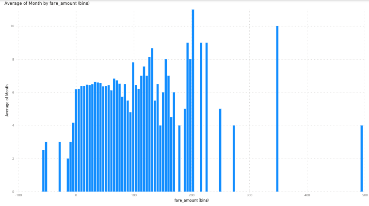

# Uber-dataset
# Uber Fares Dataset Analysis

**Name:** Kamashara G. Jessica
**Student ID:** 27630  
**Tool Used:** Power BI  

---

##  Project Overview

This project explores Uber fare data using Power BI, with a focus on uncovering temporal trends, pricing behavior, and demand patterns. The dashboard provides a comprehensive view of how ride requests and fare distributions vary by hour, weekday, and month. The analysis is designed to assist stakeholders in understanding user behavior and improving operational and pricing decisions. Key performance indicators are visualized across multiple dimensions to uncover actionable insights for the ride-hailing industry.

---

##  Dashboard Visuals

1. **Fare Amount by Weekday**  
   

2. **Number of Rides by Hour (Line Chart)**  
   

3. **Conut Fare by Hour**  
   

4. ** Fare vs Trip Distance**  
   

5. **Binned Average Fare Distribution**  
   

6. **Ride Count by month (Histogram)**  
     
                                                                                                                                                                                                             6. **Ride Count by month (Histogram)**  
                                                           
---

##  Insights

The visualized data reveals strong weekly and hourly demand trends, with Fridays and Thursdays generating the highest fare amounts, indicating increased ride activity toward the weekend. Hourly analysis shows peak trip volumes from 4 PM to 8 PM, consistent with after-work travel and evening events, while demand significantly drops after midnight. The average fare remains stable across the day but slightly increases in late-night hours, possibly due to surge pricing or longer trips. December and July show higher trip distances and fare totals, pointing to seasonal travel patterns around holidays. Most fares fall within affordable price ranges, though high-value outliers suggest occasional long or premium rides. These findings point to predictable user behavior that Uber can use to optimize pricing, driver incentives, and service availability.

---

##  Recommendations

- Introduce or reinforce surge pricing during 4–8 PM and on Fridays to maximize earnings.
- Encourage driver shifts to align with morning and evening peak hours for higher efficiency.
- Prepare operationally for longer trips in December and July by increasing driver coverage.
- Monitor and evaluate high-value outliers to ensure pricing remains transparent and fair.
- Consider promotional offers on low-demand days (like Monday) to stimulate usage.

---

##  Conclusion

The Uber fare data analyzed through Power BI provides key insights into customer behavior, demand cycles, and pricing dynamics. With clear temporal trends and seasonal variations, Uber can make data-driven decisions that balance user satisfaction with profitability. The dashboard offers a foundation for deeper exploration in future phases, including customer segmentation, route optimization, and predictive modeling.

---

##  File Contents

- `power bi assignment.pbix`: Main Power BI dashboard file
